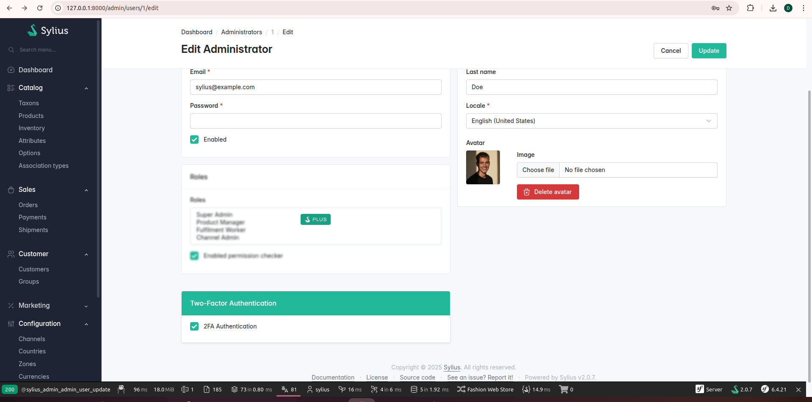
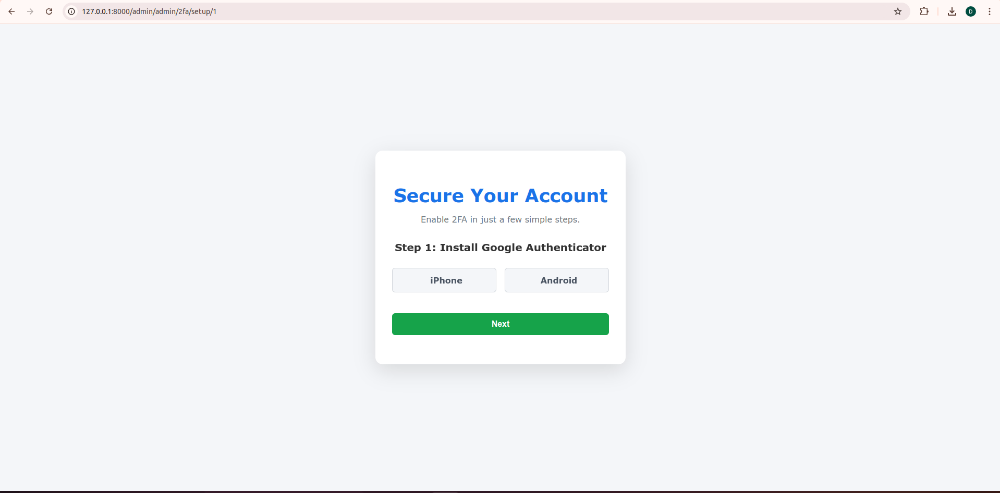
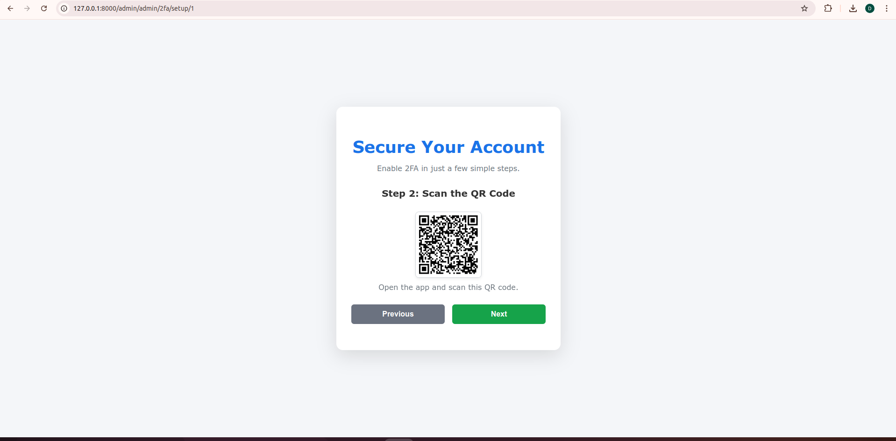
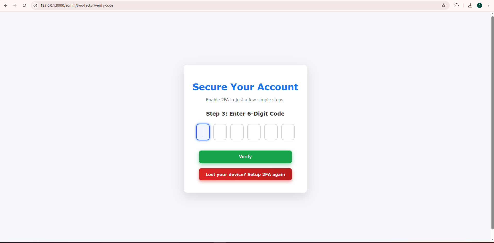
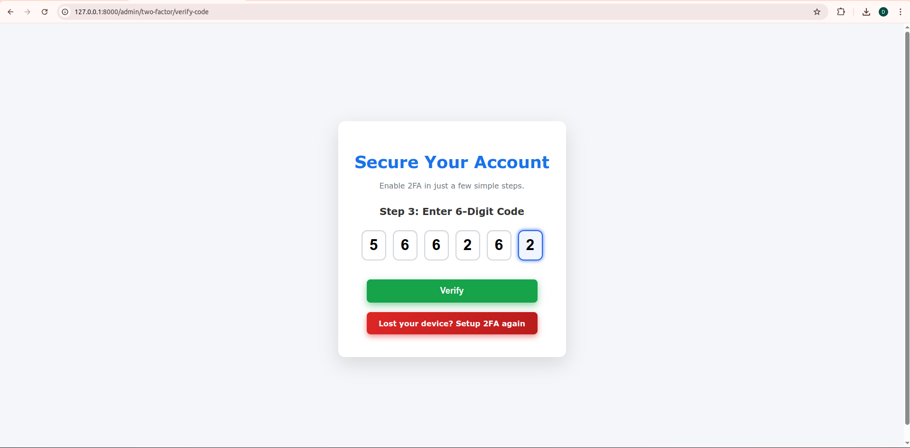

# Sylius 2FA Google Authenticator Plugin

This plugin adds Google Two-Factor Authentication (2FA) support to Sylius 2.0 Admin Users using the [`scheb/2fa-bundle`](https://github.com/scheb/2fa-bundle) and [`scheb/2fa-google-authenticator`](https://github.com/scheb/2fa-google-authenticator). It enables admins to secure their accounts with Google Authenticator codes.

---

## Features

- Integrates Google Authenticator for 2FA on Sylius Admin User accounts
- Admin UI toggle to enable or disable 2FA per user
- Secure toggle with CSRF protection via AJAX
- Extends Sylius AdminUser entity to implement `TwoFactorInterface`
- QR code generation with [`endroid/qr-code`](https://github.com/endroid/qr-code)

---

## Requirements

- Sylius 2.0
- PHP 8.x
- Composer

---
## Configuration
Make sure your Symfony app has the following configuration file:

```bash
# config/packages/scheb_2fa.yaml

scheb_two_factor:
    security_tokens:
        - Symfony\Component\Security\Core\Authentication\Token\UsernamePasswordToken
        - Symfony\Component\Security\Http\Authenticator\Token\PostAuthenticationToken
    google:
        enabled: true
```

# VivanWebSolution Sylius 2FA Plugin

You can install the plugin using Composer:

```bash
composer require vivanwebsolution/sylius-2fa-plugin
```
After installation, make sure to clear the cache and run any necessary migrations:


```bash
php bin/console cache:clear

php bin/console doctrine:schema:update --force
```

## Installation

### Step 1: Require dependencies

Run this command to install the necessary packages:

```bash
composer require scheb/2fa-bundle scheb/2fa-google-authenticator spomky-labs/otphp

composer require endroid/qr-code:^6.0 -W
```
### Step 2:  Register the Scheb Two Factor Bundle

In your Symfony config (config/bundles.php), add:

```bash
return [
    // ...
    Scheb\TwoFactorBundle\SchebTwoFactorBundle::class => ['all' => true],
];
```
### Step 3:  Extend your AdminUser entity

Extend your AdminUser entity to implement TwoFactorInterface and use the GoogleTwoFactorTrait:

```bash
<?php

declare(strict_types=1);

namespace Tests\Application\Entity\User;

use Doctrine\ORM\Mapping as ORM;
use Sylius\Component\Core\Model\AdminUser as BaseAdminUser;
use VivanWebSolution\Sylius2FAPlugin\Trait\GoogleTwoFactorTrait;
use Scheb\TwoFactorBundle\Model\Google\TwoFactorInterface;

#[ORM\Entity]
#[ORM\Table(name: 'sylius_admin_user')]
class AdminUser extends BaseAdminUser implements TwoFactorInterface
{
    use GoogleTwoFactorTrait;
}
```
### Step 4:  Override admin user form template

Create or override the template:
```bash
tests/Application/templates/bundles/SyliusAdminBundle/admin_user/form/sections.html.twig
```
Add the following 2FA toggle section inside the form:
```bash

```
### Step 5:  Add this file 

```bash
# /var/www/html/mobio/AcmeStore/config/routes.yaml

vivan_sylius_2fa_plugin_admin:
    resource: '@VivanWebSolutionSylius2FAPlugin/config/admin_routing.yaml'
    prefix: /admin
```
### Step 6:  Configure SchebTwoFactorBundle

Create or update your config file:

```bash
# config/packages/scheb_two_factor.yaml

scheb_two_factor:
    security_tokens:
        - Symfony\Component\Security\Core\Authentication\Token\UsernamePasswordToken
    google:
        enabled: true
        server_name: 'Sylius Admin'
        issuer: 'YourCompanyName'
```
## Usage

1. **Log in** to the Sylius Admin panel.

2. Navigate to the **Admin User detail page**.

3. Use the **checkbox** in the "Two-Factor Authentication" section to enable or disable Google 2FA for that admin user.

4. When 2FA is enabled, the user will be prompted to enter a **Google Authenticator code** after logging in with their credentials.

## References

- [Scheb Two Factor Bundle](https://github.com/scheb/two-factor-bundle) – Provides two-factor authentication support for Symfony.
- [Scheb Google Authenticator](https://github.com/scheb/two-factor-bundle#google-authenticator) – Adds Google Authenticator support to the Scheb bundle.
- [Endroid QR Code](https://github.com/endroid/qr-code) – Used for generating QR codes for Google Authenticator setup.

## Functionality Screenshot






